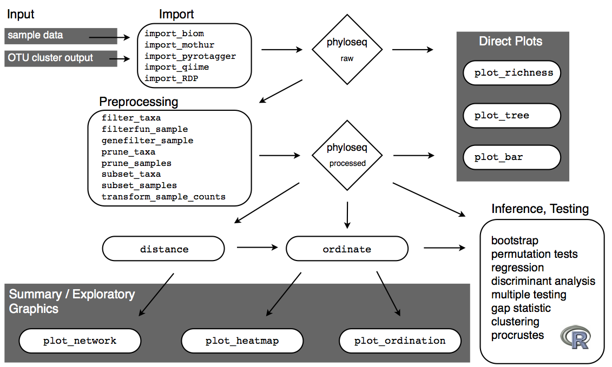
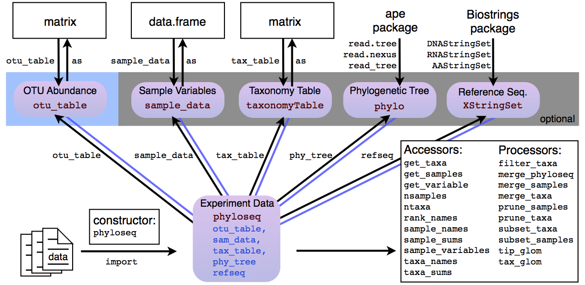

<link href='http://fonts.googleapis.com/css?family=Lato&subset=latin,latin-ext' rel='stylesheet' type='text/css'>

<style type="text/css"> 
.small-code pre code {
  font-size: 1em;
}
body{
  font-family: Lato;
  font-size: 16pt;
}
h1{
  font-family: Lato;
  font-size: 32pt;
  color: #0080FF;
}

b, strong {
 color: #0080FF;
}

h2,h3,h4,h5,h6{
  font-family: Lato;
  font-size: 24pt;
  color: #0080FF;
}
</style>

```{r initialize, echo = FALSE, warning = FALSE}
## Set default options for code chunks
knitr::opts_chunk$set(tidy = FALSE, cache = TRUE, autodep = TRUE,
     dev = "png", dpi = 70,
     size = "small", fig.width = 8, fig.height = 6,
     message = FALSE, error = FALSE, warning = TRUE)

## output width
base::options(width = 70)

## set seed - to have reproducibility
set.seed(0xbedada)
```


```{r setup, include=FALSE}
knitr::opts_chunk$set(echo = TRUE)
knitr::opts_chunk$set(cache = TRUE)
```


# Goal and Schedule

In this lab we will learn the basics of the analysis of microbiome data 
using the `phyloseq` package and  some 
refinements of the graphics using the `ggplot2` package.

- 11.20 - 12.30: Importing data into phyloseq, plotting trees, diversity, transforming data with labs. 
- 12.30 - 1.30  Lunch break time
- 1.30 - 2.15 : Ordination and networks with phyloseq: examples and lab.


# Introduction to (Introduction to phyloseq)

The goal of the phyloseq package is to facilitate 
the kind of interactive, "not canned" workflow 
depicted in the graphic below.

The three main steps in phyloseq are:

- import data (produces phyloseq data object)
- filter and summarize data (agglomerate, ordinate)
- plot data

The phyloseq pacakge provides special functions 
for accomplishing this in a way that is 
consistent, reliable, low-error, and reproducible.




## A phyloseq object

A phyloseq object can contain multiple related tables, 
a tree, and even the sequence corresponding 
to each observation in the "OTU table".

A picture is maybe better than words, here:




# Load Packages

Make sure you have the installed packages from both CRAN and BioConductor.

```{r warning=FALSE, message=FALSE}
biocpkgs_needed = c("ggplot2", "phyloseq")
pkgs_needed = c("PMA","dplyr","ade4","ggrepel","vegan", "tidyverse", "ggtree")
letsinstall = setdiff(pkgs_needed, installed.packages()) 
letsinstallb = setdiff(biocpkgs_needed, installed.packages()) 
if (length(letsinstallb) > 0) {
if (!requireNamespace("BiocManager", quietly = TRUE))
    install.packages("BiocManager")
BiocManager::install(letsinstallb, version = "3.9")
}
```

Load packages.

```{r warning=FALSE, message=FALSE}
require("tidyverse")
library("ggplot2")
library("dplyr")
library("phyloseq")
```

ggplot2 package theme set. See [the ggplot2 online documentation](http://docs.ggplot2.org/current/) for further help.

```{r ggplot2-theme-set}
theme_set(theme_bw())
```


# Load data 

- Load data already available in `phyloseq`

There are multiple example data sets included in phyloseq. 
Many are from published investigations and include documentation with a summary and references, as well as some example code representing some aspect of analysis available in phyloseq.

## Load Example Data

To load example data into the working environment, use the `data()` command:

```{r eval=FALSE}
data(GlobalPatterns)
data(esophagus)
data(enterotype)
data(soilrep)
```

## Documentation

In the package index, go to the names beginning with "data-" to see the documentation of currently available example datasets.

Try for example

```{r eval=FALSE}
?GlobalPatterns
```

to access the documentation for the so-called "GlobalPatterns" dataset.

You can also look at a composite object with the object viewer by clicking on
the object name in RStudio after you have loaded it with the `data()` command.


```{r}
data(enterotype)
```

**Question 1**: Using the  Environment tab/pane in RStudio, click on enterotpype to inspect
the enterotype object, how many biological samples does it contain?


The phyloseq package is a tool to import, store, analyze, and graphically display complex phylogenetic sequencing data. Take some time to explore the object, before we start doing statistical analyses.


## Running provided examples

You can also try the examples included with the example data documentation (as well as examples for functions/methods) using the standard `example` command in R -- in this case the examples for the `enterotype` dataset.

**Question 2** : What type of output does the enterotype example provide?

```{r run-examples}
example(enterotype, ask=FALSE)
```

**Question 3** : Bioconductor objects are often lists whose components are called `slots`.
How many `slots` does the `GlobalPatterns` object have?

```{r }
data(GlobalPatterns)
GlobalPatterns
```

**Question 4** : What is the dimension of its `otu_table` component?

```{r}
dim(otu_table(GlobalPatterns))
```

**Question 5**: How many different levels does the `SampleType` variable in the
`sample_data` slot of the GlobalPatterns data have?

**Question 6**: Make alpha diversity plots, one for each different Sample Type.
Here is an example with the Chao index, try other methods (Shannon for instance).

```{r}
plot_richness(GlobalPatterns, x="SampleType", measures=c("Chao1"))
```


# Import Microbiome Count Data

The data we will analyze in the first part of the lab corresponds to 360 fecal samples which were collected from 12 mice longitudinally over the first year of life, to investigate the development and stabilization of the murine microbiome. Let's (down)load the dataset:

```{r}
download.file("https://cdn.rawgit.com/spholmes/F1000_workflow/891463f6/data/ps.rds",
              "ps.rds",
              mode="wb")
ps = readRDS("ps.rds")
```
The `ps` object is of class `phyloseq` from the package `phyloseq`.

```{r}
class(ps)
```

We often use "rds" files because they have better compression than the ordinary `.rda` or
`.RData` files.

**Question 7**: How many slots does the `ps` object have?

**Question 8**: How many distinct Phyla (such as "Bacteroidetes") have been identified in this dataset? (Hint: Look up the `tax_table` function and then inspect its output. Also make sure to ignore potential `NA` values!)

```{r}
tax_table(ps)[,"Phylum"] %>% unique %>% na.exclude %>% length
```

**Question 9**: In total, does this dataset include more measurements for female or male mice (Hint: Look up the documentation of `sample_data`)?

```{r}
table(sample_data(ps)$sex)
```

**Question 10**: How many unique female mice were part of this experiment?

```{r}
sample_data(ps) %>% group_by(sex) %>% dplyr::summarize(n = length(unique(host_subject_id)))
```


## Import from legacy QIIME

The phyloseq package comes with example legacy QIIME output files.
The way to find these files on your system is:

```{r}
otufile <- system.file("extdata", "GP_otu_table_rand_short.txt.gz", package="phyloseq")
otufile
mapfile <- system.file("extdata", "master_map.txt", package="phyloseq")
mapfile
trefile <- system.file("extdata", "GP_tree_rand_short.newick.gz", package="phyloseq")
trefile
```

Now use the `import_qiime` function to import the data 
from these three files, and generate a phyloseq object.

```{r}
gp = import_qiime(otufile, mapfile, trefile, verbose=FALSE)
class(gp)
```

## Exercises

1. What are the components of the phyloseq object, `gp`?
```{r}
gp
```

1. How many taxa (OTUs) does it have?
```{r}
ntaxa(gp)
```

1. How many samples does it have?

```{r}
26
```

1. How many variables are there in the sample data?

```{r}
sample_variables(gp)
gp %>% sample_data() %>% ncol
```

1. Import the OTU table encoded in "biom" format at the following path,
also included with phyloseq (hint: use `import_biom()`):

```{r}
biomFile <- system.file("extdata", "rich_dense_otu_table.biom", package="phyloseq")
biomFile
```
Answer:
```{r}
import_biom(biomFile)
```

1. What are the answers to questions above about `gp`, but for this new data?
1. **BONUS** What is the total of all counts in each dataset?


# Preprocessing, filtering, munging

Before doing the statistical analyses, we will do some basic "data munging"

First remove features with ambiguous Phylum annotation:

```{r}
ps = subset_taxa(ps, !is.na(Phylum) & !Phylum %in% c("", "uncharacterized"))
```


Now let's look at a histogram of the ages of the mice:


```{r}
ggplot(sample_data(ps), aes(x=age)) + geom_histogram() + xlab("age")
```

We see that the ages of the mice come in a couple of groups, and so we make a categorical variable corresponding to young, middle-aged, and old mice. 

```{r}
sample_data(ps)$age_binned = cut(sample_data(ps)$age,
  				          breaks = c(0, 100, 200, 400))
```

Furthermore, we  could log-transform the data. This is an approximate variance stabilizing transformation (it would be more appropriate to use the variance stabilizing functionality available in the `DESeq2` package).

```{r}
pslog = transform_sample_counts(ps, function(x) log(1 + x))
```

Microbial abundance data is often heavy-tailed, and sometimes it can be hard to identify a transformation that brings the data to normality. In these cases, it can be safer to ignore the raw abundances altogether, and work instead with ranks. 

This is called a robust method and
we demonstrate this idea using a rank-transformed version of the data. 

First, we create a new matrix, representing the abundances by their ranks, where the microbe with the smallest in a sample gets mapped to rank 1, second smallest rank 2, etc.


## Filter

The following are key phyloseq functions for filtering/subsetting

- `prune_taxa`
- `prune_samples`
- `subset_taxa`
- `subset_samples`

`subset_taxa` and `subset_samples` are convenience wrapper around the `subset` function.
You can think of them as analogous to the `filter()` function in the tidyverse.
They support expressions of inclusion based on 
the `tax_table` or `sample_data`, respectively.

```{r}
# Only Firmicutes
subset_taxa(gp, Phylum == "Firmicutes")
# Only ocean samples
subset_samples(gp, SampleType == "Ocean")
```

`prune_taxa` and `prune_samples` are functions
for filtering based on an previously defined inclusion vector.
You can think of this as similar to square bracket notation 
on rows or columns of a table.

```{r}
# keep only taxa that were observed at least twice
prune_taxa(taxa_sums(gp) >= 2, gp)
# keep only samples with count greater than 2000
prune_samples(sample_sums(gp) >= 2000, gp)
```

### examples

1. How do you remove taxa that were only observed 1 time in the whole dataset?

```{r}
(taxa_sums(gp) > 1) %>% sum
```

1. **BONUS** - How do you filter to just taxa that appeared in more than one sample
(prevalence >= 2)?
```{r}
filter_taxa(gp, function(x){sum(x > 0) > 1}, prune = TRUE)
```
What about more than 5 samples?
```{r}
filter_taxa(gp, function(x){sum(x > 0) > 5}, prune = TRUE)
```

1. How do you remove samples that had less than 4500 reads (total count)?

```{r}
prune_samples(sample_sums(gp) > 4500, gp)
```

1. How do you filter to just samples that derive from the human body?

```{r}
# Which samples are human
sample_data(gp)[["SampleType"]] %in% c("Mock", "Skin", "Tongue", "Feces")
# get_variable(gp, "SampleType") %in% c("Mock", "Skin", "Tongue", "Feces")
humanSample = sample_data(gp)[["SampleType"]] %in% c("Mock", "Skin", "Tongue", "Feces")
prune_samples(samples = humanSample, gp)
```

## Aggregate observations

- `tax_glom()` -- Taxonomy-defined, taxonomy-aware agglomeration of observations.
- `tip_glom()` -- Tree-defined, taxonomy-aware agglomeration of observations.

```{r}
# agglomerate at the taxonomic rank of Family
(tax_glom(gp, taxrank="Order"))
```

`tip_glom()` can take time for a dataset with a large number of taxa, 
so let's first apply our newly-acquired tidyverse knowledge, 
and determine a phylum with a manageable number of unique OTUs.
We will subset to just this Phylum for the purposes of demonstrating
tree-based agglommeration quickly.

```{r}
gp %>% 
  psmelt %>%
  group_by(Phylum) %>% 
  summarize(OTUn = (unique(OTU) %>% length)) %>% 
  arrange(desc(OTUn))
```

```{r}
gpAcid <- subset_taxa(gp, Phylum == "Acidobacteria")
plot_tree(gpAcid, label.tips="taxa_names", 
          size="abundance", title="Before tip_glom()", ladderize = "left")
gpTipGlom <- tip_glom(gpAcid, h = 0.2)
plot_tree(gpTipGlom, label.tips="taxa_names", 
          size="abundance", title="After tip_glom()", ladderize = "left")
```

## aggregate taxa

1. In `gp` dataset, what are available ranks in the taxonomy
(Hint: try `rank_names()`)?

```{r}
rank_names(gp)
```

1. Use `tax_glom()` to agglomerate at taxonomic rank "Family".
```{r}
gpFam <- tax_glom(gp, "Family")
gpFam
```

1. How many taxa before/after agglomeration (Hint: use `ntaxa`)?

```{r}
ntaxa(gp)
ntaxa(gpFam)
```

1. What is the `h` parameter in `tip_glom`?

> `h` is the height where the tree should be cut to define agglomeration groups. 
> This refers to the tree resulting from hierarchical clustering of `cophenetic.phylo(phy_tree(physeq))`, 
> not necessarily the original phylogenetic tree, `phy_tree(physeq)`

1. What happens when you increase the value of `h`?
> It will make cluster with larger number of members, 
> smaller number of distinct features.

```{r, eval=FALSE}
tip_glom(gp, h = 0.5)
```


**Question 11** What does the function `t()` do?


```{r}
abund = otu_table(ps)
abund_ranks = t(apply(abund, 1, rank))
```

**Question 12**
Pick a few taxa (say the first, second and forth) and compare the ranks for the log transformed data and the raw data:

```{r}
abund_l = otu_table(pslog)
abund_logranks = t(apply(abund_l, 1, rank))
```

```{r}
cor(abund_logranks[,1],abund_ranks[,1])
cor(abund_logranks[,2],abund_ranks[,2])
cor(abund_logranks[,4],abund_ranks[,4])
```

What do you notice?

Naively using these ranks could make differences between pairs of low and high abundance microbes comparable. In the case where many bacteria are absent or present at trace amounts, an artificially large difference in rank could occur for minimally abundant taxa. To avoid this, all those microbes with rank below some threshold are set to be tied at 1. The ranks for the other microbes are shifted down, so there is no large gap between ranks. 

```{r}
abund_ranks = abund_ranks - 329
abund_ranks[abund_ranks < 1] = 1
```

If we want to use these data later on, we can save them as a compressed `R` file with:

```{r}
saveRDS(abund_ranks,"abund_ranks.rds")
```

**Question 13** Compute the correlations between these data using the function `cor` and then as a bonus, plot the correlations as usefully as you can.


# Plots in phyloseq

## Plots

Let's jump into plotting using phyloseq.

- `plot_richness()`
- `plot_ordination()`
- `plot_heatmap()`
- `plot_tree()` (use `gpAcid`, or something < 200 taxa)
- `plot_bar()`
- `plot_net()`

1. Try out each plot function.
```{r}
# go for it
```

1. When might you use each?
>depends on what you need to emphasize, show, explore.

1. What is `plot_richness()` showing you? 
Which variables in this plot data are good 
for mapping to `color` or faceting?
```{r}
plot_richness(gp, x = "SampleType", color = "SampleType",
              measures = "Shannon")
```

1. Does it look like there are differences
in alpha-diversity between sample sources?
>Yes

1. Try different distances and ordination methods for 
`plot_ordination` and `plot_heatmap`.
```{r}
ordinate(gp, "PCoA", "bray") %>% 
  plot_ordination(gp, ., color = "SampleType", title = "Bray-Curtis")
ordinate(gp, "PCoA", "wUniFrac") %>% 
  plot_ordination(gp, ., color = "SampleType", title = "weighted-UniFrac")
ordinate(gp, "NMDS", "wUniFrac") %>% 
  plot_ordination(gp, ., color = "SampleType", title = "weighted-UniFrac")
plot_heatmap(physeq = gp, method = "MDS", distance = "wUniFrac", 
             title = "weighted-UniFrac", taxa.label = FALSE)
```

1. Try different distances for `plot_net`.

```{r}
plot_net(gp, "bray", color = "SampleType")
plot_net(gp, "WUniFrac", color = "SampleType")
```

1. Try different values of special arguments in `plot_net`

```{r}
# Here are supported options
plot_net(laymeth='list')
# Here are examples
plot_net(gp, "bray", color = "SampleType", laymeth = "circle")
plot_net(gp, "bray", color = "SampleType", laymeth = "reingold.tilford")
plot_net(gp, "bray", color = "SampleType", laymeth = "svd")
```


We want to plot trees, sometimes even bootstrap values, but notice that the node labels in the `GlobalPatterns` dataset are actually a bit strange. They look like they might be bootstrap values, but they sometimes have two decimals.

```{r}
head(phy_tree(GlobalPatterns)$node.label, 10)
```

There are actual a second set of spurious labels that were appended to some
node labels.
Could systematically remove the second decimal, but why not just take the first 4 characters instead?
```{r}
phy_tree(GlobalPatterns)$node.label = substr(phy_tree(GlobalPatterns)$node.label, 1, 4)
```

Great, now that we're more happy with the node labels at least looking like bootstrap values, we can move on to using these along with other information about data mapped onto the tree graphic.

The `GlobalPatterns` dataset has many OTUs, more than we would want to try to fit on a tree graphic
```{r}
ntaxa(GlobalPatterns)
```
So, let's arbitrarily prune to just the first 50 OTUs in `GlobalPatterns`, and store this as `physeq`, which also happens to be the name for most main data parameters of function in the phyloseq package.

```{r}
physeq = prune_taxa(taxa_names(GlobalPatterns)[1:50], GlobalPatterns)
```

Now let's look at what happens with the default `plot_tree` settings.
```{r}
plot_tree(physeq)
```

By default, black dots are annotated next to tips (OTUs) in the tree, one for each sample in which that OTU was observed. Some have more dots than others. 

Also by default, the node labels that were stored in the tree were added next to each node without any processing (although we had trimmed their length to 4 characters in the previous step).

What if we want to just see the tree with no sample points next to the tips?
```{r}
plot_tree(physeq, "treeonly")
```

And what about without the node labels either?
```{r}
# plot_tree(physeq, "treeonly", nodeplotblank)
```

We can adjust the way branches are rotated to make it look nicer using the `ladderize` parameter.
```{r}
# plot_tree(physeq, "treeonly", nodeplotblank, ladderize="left")
# plot_tree(physeq, "treeonly", nodeplotblank, ladderize="right")
```

And what if we want to add the OTU labels next to each tip?
```{r}
# plot_tree(physeq, nodelabf=nodeplotblank, label.tips="taxa_names", ladderize="left")
```

Any `method` parameter argument other than `"sampledodge"` (the default) will not add dodged sample points next to the tips.
```{r}
# plot_tree(physeq, "anythingelse")
```

## Mapping Variables in Data

In the default argument to `method`, `"sampledodge"`, a point is added next to each OTU tip in the tree for every sample in which that OTU was observed. We can then map certain aesthetic features of these points to variables in our data.

## Color

Color is one of the most useful aesthetics in tree graphics when they are complicated. Color can be mapped to either taxonomic ranks or sample covariates. For instance, we can map color to the type of sample collected (environmental location).

```{r}
# plot_tree(physeq, nodelabf=nodeplotboot(), ladderize="left", color="SampleType")
```

and we can alternatively map color to taxonomic class.

```{r}
# plot_tree(physeq, nodelabf=nodeplotboot(), ladderize="left", color="Class")
```


## Shape

You can also map a variable to point shape if it has 6 or fewer categories, and this can be done even when color is also mapped. Here we map shape to taxonomic class so that we can still indicate it in the graphic while also mapping `SampleType` to point color.

```{r}
# plot_tree(physeq, nodelabf=nodeplotboot(), ladderize="left", color="SampleType", shape="Class")
```

## Node labels

One of the most common reasons to label nodes is to add confidence measures, often a bootstrap value, to the nodes of the tree. The following graphics show different ways of doing this (labels are added by default if present in your tree).

```{r}
# # The default
# plot_tree(physeq, color="SampleType", ladderize="left")
# # Special bootstrap label
# plot_tree(physeq, nodelabf=nodeplotboot(), color="SampleType", ladderize="left")
# # Special bootstrap label with alternative thresholds
# plot_tree(physeq, nodelabf=nodeplotboot(80,0,3), color="SampleType", ladderize="left")
```

## Tip labels

- **label.tips** - The `label.tips` parameter controls labeling of tree tips (AKA leaves).  Default is NULL, indicating that no tip labels will be printed. 
Using `taxa_names` is a special argument resulting in the OTU name (try `taxa_names` function) being labelled next to the leaves or next to the set of points that label the leaves. Alternatively, if your data object contains a `tax_table`, then one of the rank names (from `rank_names(physeq)`) can be provided, and the classification of each OTU at that rank will be labeled instead.

- **text.size** - A positive numeric argument indicating the ggplot2 size parameter for the taxa labels. Default is `NULL`. If left as `NULL`, this function will automatically calculate a (hopefully) optimal text size given the size constraints posed by the tree itself (for a vertical tree). This argument is included mainly in case the automatically-calculated size is wrong and you want to change it. Note that this parameter is only meaningful if `label.tips` is not `NULL`

```{r}
# plot_tree(physeq, nodelabf=nodeplotboot(80,0,3), 
#           color="SampleType", label.tips="taxa_names", ladderize="left")
```


##  Barplots for composition visualization

The following is the default barplot when no parameters are given. The dataset is plotted with every sample mapped individually to the horizontal (`x`) axis, and abundance values mapped to the veritcal (`y`) axis. At each sample's horizontal position, the abundance values for each OTU are stacked in order from greatest to least, separate by a thin horizontal line. As long as the parameters you choose to separate the data result in more than one OTU abundance value at the respective position in the plot, the values will be stacked in order as a means of displaying both the sum total value while still representing the individual OTU abundances.

We start by taking a subset of taxa, those of the Chlamydiae Phylum:

```{r}
gp.ch = subset_taxa(GlobalPatterns, Phylum == "Chlamydiae")
```

Then the default `plot_bar()` functions visualizes the data.

```{r}
plot_bar(gp.ch)
```

Add fill color to represent the Genus to which each OTU belongs.

```{r}
plot_bar(gp.ch, fill="Genus")
```

Now keep the same fill color, and group the samples together by the `SampleType` variable; essentially, the environment from which the sample was taken and sequenced. 
```{r}
plot_bar(gp.ch, x="SampleType", fill="Genus")
```

Note that abundance values for the same OTU from the same `SampleType` will be stacked as separate bar segments, and so the segment lines may not accurately portray the observed richness (because the same OTU might be shown more than once for the same horizontal axis grouping). However, all other aspects of the representation are quantitative, with the total stacked bar height at each horizontal position indicating the sum of all reads for that sample(s). There is no attempt by `plot_bar` to normalize or standardize your data, which is your job to do (using other tools in the phyloseq pacakge, for instance) before attempting to interpret/compare these values between samples.

## More Sophisticated Organization using Facets

In the following example we elected to further organize the data using "facets"  -- separate, adjacent sub-plots. In this case the facets allow us to according to the genus of each OTU. Within each genus facet, the data is further separated by sequencing technology, and the enterotype label for the sample from which each OTU originated is indicated by fill color.

```{r, fig.width=12, fig.height=6}
plot_bar(gp.ch, "Family", fill="Genus", facet_grid=~SampleType)
```


## Further customization using ggplot2 layers

Note that additional customizations of the plot are always possible using standard ggplot2 layers. For example, the following code chunk shows a plot with jittered points add using a second plot layer. 
```{r, fig.width=12, fig.height=6}
library("ggplot2")
p = plot_bar(gp.ch, "Family", fill="Genus", facet_grid=~SampleType)
p + geom_point(aes(x=Family, y=Abundance), color="black", position="jitter", size=3)
```

## Enterotypes dataset examples

First, load package (if you haven't already), then trim Enterotype data to most abundant 10 genera.

```{r, message=FALSE}
TopNOTUs <- names(sort(taxa_sums(enterotype), TRUE)[1:10])
ent10   <- prune_species(TopNOTUs, enterotype)
```

The parameters to `plot_bar` in the following code-chunk were chosen after various trials. We suggest that you also try different parameter settings while you're exploring different features of the data. 

In addition to the variables names of `sample_data`, the `plot_bar` function recognizes the names of taxonomic ranks, if present. 

In this example we have also elected to organize data by "facets" (separate, adjacent sub-plots) according to the genus of each OTU. Within each genus facet, the data is further separated by sequencing technology, and the enterotype label for the sample from which each OTU originated is indicated by fill color. Abundance values from different samples and OTUs but having the same variables mapped to the horizontal (`x`) axis are sorted and stacked, with thin horizontal lines designating the boundaries. With this display it is very clear that the choice of sequencing technology had a large effect on which genera were detected, as well as the fraction of OTUs that were assigned to a Genus.

```{r, fig.width=12, fig.height=5.5}
plot_bar(ent10, "SeqTech", fill="Enterotype", facet_grid=~Genus)
```

You could nix the approach in which OTU abundance values from different samples, different enterotypes, are stacked together and simply shaded differently, and instead opt to separate both the enterotype designation of the samples and the genus designation of the OTUs into one grid. Only a slight modification to the previous function call is necessary in that case (with an added fill to make it even easier to read):

```{r, fig.width=10, fig.height=10}
plot_bar(ent10, "Genus", fill="Genus", facet_grid=SeqTech~Enterotype)
```


		


# Bonus Material `:-)`

## (Bonus) psmelt -- phyloseq and tidyverse

Sometimes you'll want to define your own ggplot from scratch,
or you'll want to use the many Data Frame oriented tools
provided in the tidyverse. 
To address these, phyloseq provides a "melting" function,
`psmelt()`, that converts the complicated 
phyloseq-encoded data into a "tidy" data frame.
In fact, most phyloseq plot functions depend on `psmelt()`.
Reading the code of these functions can help you get ideas
for how you might define your own custom plots.

(Caveat, trees are not naturally represented by a table,
so `psmelt` does not attempt to return anything encoded in the tree).

Try it:

```{r}
gpAcid %>% 
  psmelt() %>% 
  group_by(Sample) %>% 
  mutate(Proportion = Abundance / sum(Abundance, na.rm = TRUE)) %>% 
  filter(Proportion > 0) %>% 
  filter(!is.na(Class)) %>% 
  ggplot(aes(y = Class, x = log10(Proportion), fill = Class)) +
  ggridges::geom_density_ridges2(scale = 1, alpha = 0.7, show.legend = FALSE) +
  ggtitle("Compare distribution of relative abundances")
  # geom_violin() +
  # coord_flip()
```


## (Bonus) ggtree

The ggtree package is the best way to make complex tree visualizations in R
(to my knowledge).
If ggtree had been around when I began phyloseq, 
I would have used it instead of writing `plot_tree` from scratch.

```{r, message=FALSE, fig.height=12, fig.width=6}
if(!require("ggtree")){
  BiocManager::install("ggtree")
  library("ggtree")
}
gp %>% 
  phy_tree() %>% 
  ggtree(ladderize = TRUE)
```


```{r}
gpForExampleTree <- 
  gp %>% 
  filter_taxa(physeq = ., flist =  function(x){sum(x > 0) > 10}, prune = TRUE)
gpForExampleTree
justPhyloTree <- 
  gpForExampleTree %>% 
  phy_tree() %>% 
  ape::root("591182", resolve.root = TRUE)
  # ape::root("D12", resolve.root = TRUE)
pTree <- 
  ggtree(justPhyloTree, ladderize = TRUE, right = TRUE) + 
  geom_tiplab(size=2)
pTree %>% print
```

### tree + heatmap

For associating phylogenetic tree with different type of plot produced by user’s data, ggtree provides  facet_plot function which accepts an input data.frame and a geom function to draw the input data. The data will be displayed in an additional panel of the plot.

```{r}
library("data.table")
tableTreeMap <-
  gpForExampleTree %>% 
  psmelt() %>% 
  data.table %>% 
  .[, Proportion := Abundance / sum(Abundance),  by = "Sample"] 
dummyValue <- (tableTreeMap[(Proportion > 0.0)]$Proportion %>% min)/10
tableTreeMap <-
  tableTreeMap %>% 
  .[(Proportion <= 0.0), Proportion := dummyValue] %>% 
  .[, log10Proportion := log10(Proportion)] %>% 
  dcast.data.table(
    formula = OTU ~ SampleType, 
    value.var = "log10Proportion",
    fill = NA_real_,
    fun.aggregate = mean, na.rm = TRUE)
taxaNames <- tableTreeMap$OTU
tableTreeMap[, OTU := NULL]
tableTreeMap <- data.frame(tableTreeMap)
rownames(tableTreeMap) <- taxaNames
tableTreeMap %>% head
```

```{r}
library("ggtree")
gheatmap(
  p = pTree, 
  data = tableTreeMap, 
  low = "white", high = "darkgreen",
  offset=0.1, width=0.5, font.size=2, 
  colnames_position = "bottom",
  colnames_offset_x = 0,
  colnames_offset_y = -1,
  colnames_angle=25, hjust=1)
```

